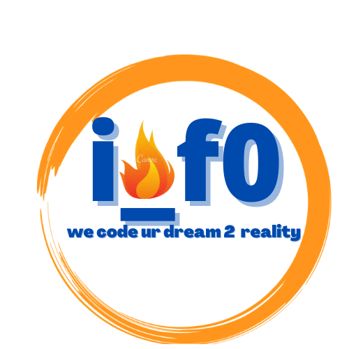

# in_a_flash0

{:height="30px" width="30px"}

in_a_flash0 is a freelancer-run GitHub organization led by a group of fresh graduates embarking on their career journey together.

We are a dynamic and experienced freelancing organization specializing in delivering high-quality software solutions. With a team of skilled and dedicated members, we aim to provide efficient and innovative services tailored to our clients' needs.

## Our Expertise

At in_a_flash0, we have expertise in a wide range of technologies, including:

- Web development
- Mobile applications
- Data analysis
- Machine learning

## Our Approach

We take pride in our ability to understand our clients' requirements and translate them into robust and scalable solutions. Our collaborative approach ensures effective communication and seamless project execution. We value transparency, and our clients can expect regular updates and clear progress reports throughout the development process.

With a strong foundation in software engineering best practices, we strive for excellence in code quality, reliability, and security. We follow industry-standard development methodologies and leverage modern tools and frameworks to create cutting-edge applications.

## Our Commitment

- **Quality:** We are committed to delivering high-quality work that meets and exceeds client expectations. We pay attention to detail and strive for excellence in every aspect of our projects.
- **Collaboration:** We believe in the power of teamwork and collaboration. By working closely together, we leverage each team member's strengths to create comprehensive and well-rounded solutions.
- **Timely Delivery:** We understand the importance of meeting deadlines. With our efficient project management processes, we ensure timely delivery of our work, allowing clients to stay on track with their goals.

## Our Services

We offer a wide range of freelancing services, including but not limited to:

- Web Development: Designing and developing user-friendly and responsive websites tailored to our clients' needs.
- Mobile App Development: Creating intuitive and engaging mobile applications for various platforms.
- UI/UX Design: Crafting visually appealing and user-centric interfaces to enhance the user experience.
- Software Development: Building custom software solutions that automate processes and streamline operations.
- Data Analysis: Extracting meaningful insights from data through advanced analytics techniques.
- Technical Writing: Producing clear and concise technical documentation to support projects.

## Let's Collaborate

We invite you to collaborate with in_a_flash0 and experience the passion and dedication we bring to each project. Whether you're a startup, a small business, or an established company, we are here to help you achieve your goals in a flash.

Reach out to us today, and let's create something amazing together!

**Contact Us:**

Email: inflash0@gmail.com
